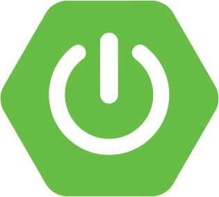

<h1 align="center">Hi there, I'm Thales </h1> 
<h3 align="center">But you can also find me as chorival
 

  
  
  
  
  

  

 

## About Me

#### - 🖥️ I'm 23 years old Full Stack Developer.

#### - 🎓 Computer Science Student at [UFRJ - Universidade Federal do Rio de Janeiro](https://ufrj.br/)

#### - 🚀 Node, React, Angular and Java

#### - 💡 Learning Next.js and Springboot

 

**At Akross as Junior Development Analyst🔍**

*************

  

    
    &nbsp;
    
  

## - Technologies

  
  
  
  
  
  
  
  
  
   
  
  
  
  
  
  
  
  
  
  
  
  
  
  
  
  
  
  
  
  
  
  
  
  
  
  
  
  
  
  
  
  
  

